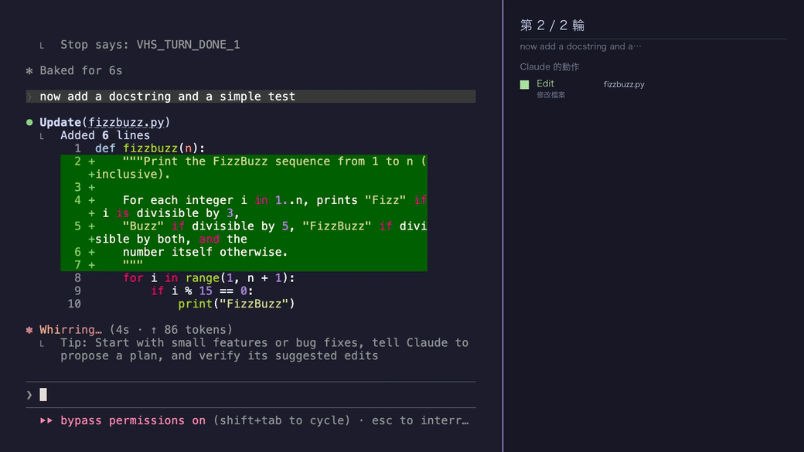
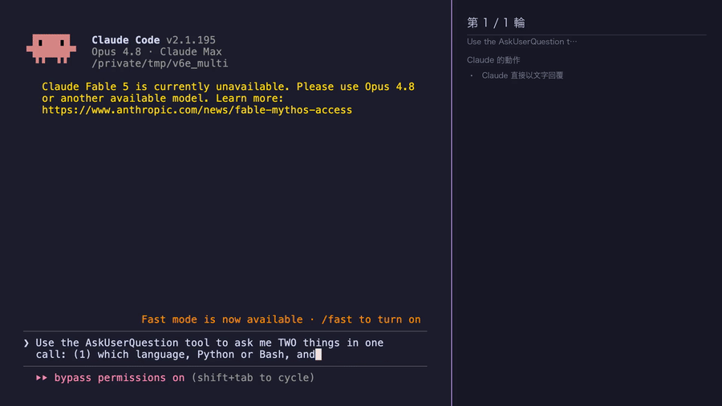

# claude-session-recorder

[](https://github.com/htlin222/claude-session-recorder/actions/workflows/test.yml)
[](LICENSE)


**Record a narrated, sync-verified teaching video of a *real* Claude Code TUI
session.** You write a short JSON script (the prompts + what to say); the tool
films an actual `claude` session, lays an explainshell-style panel on the right,
and dubs a voice that **leads** the typing — you hear *what a command will do*
before it appears. The result is a 1920×1080 MP4 where the **left terminal, the
right panel, and the voice are always in lock-step**, produced **deterministically**:
`claude` runs **once**, then the static stretches of the recording are freeze-frame
spliced to fit the authored narration. No re-takes, no drift. MIT licensed.


<sub>▶ **[Watch the full clip (MP4)](assets/demo.mp4)** — the launch lesson into Claude running Apple's `container` CLI (`script.container.json`). A mixed Claude session is shown below.</sub>



---

## Why this is hard

Naively dubbing a screen recording desyncs immediately, for two reasons:

1. **Claude's think gap is non-deterministic.** The time between "Enter" and the
   answer drifts run-to-run (38s one take, 30s the next). A voice clip sized to one
   take overruns the next, so the timeline you *design* against is never the one
   that *airs*.
2. **Independent stages disagree by a frame.** If the overlay and the panel each
   re-derive per-turn timing from the video, they desync — the recurring
   "terminal says one thing, panel says another" bug.

**v6 fixes both.** It records `claude` exactly once, treats that take's *hard*
segments (typing → submit → answer, the think gap, tool execution) as ground truth,
and re-times only the *soft* segments (the static frames where nothing happens) with
an ffmpeg freeze-frame splice — so the final timeline is computed, not detected. A
single **`ledger.json`** is the one source of truth every stage reads, so
terminal == panel == voice by construction. Full rationale:
[`event-ledger-deterministic-pipeline-design.md`](../../../../docs/plans/2026-06-28-event-ledger-deterministic-pipeline-design.md)
and the [sync-model evolution](../../../context/sync-model.md).

---

## Prerequisites

- **macOS** (Apple Silicon supported). Capture is macOS-only.
- **Python ≥ 3.10**
- **External tools:**
  ```bash
  brew install vhs ffmpeg tmux imagemagick
  # edge-tts is pulled in as a Python dep by `pip install`, or grab it standalone:
  pipx install edge-tts
  ```
- **The Claude Code CLI** (`claude`) on your `PATH`.

**Auth note:** filming runs `claude` inside an isolated sandbox with its own
`CLAUDE_CONFIG_DIR`. On this machine auth is a file, so the sandbox **copies
`~/.claude/.credentials.json`** into the throwaway config to skip login — it never
touches your real config. Sandbox dirs hold real credentials, so keep demo
directories in `/tmp` (ephemeral, gitignored); never commit one.

---

## Install

From this package directory:

```bash
pip install -e .[dev]
```

This installs the deterministic core (`numpy`, `Pillow`, `edge-tts`, `pytest`) and
puts the **`record-session`** command on your `PATH`.

---

## Quickstart

```bash
record-session /tmp/demo script.example.json
# → /tmp/demo/session_panel.mp4   (1920×1080, terminal + panel + voice + .srt)
```

`record-session <demo-dir> <script.json>` runs the whole pipeline, launching
`claude` exactly once. Three example tiers:

```bash
# 1) A basic Claude demo — write + test a FizzBuzz function
record-session /tmp/fizz   script.example.json

# 2) The Apple `container` demo — spin up a Linux micro-env on macOS
record-session /tmp/box    script.container.json

# 3) An interactive AskUserQuestion demo, answered live (robust path)
record-session /tmp/ask    script.robust.json --robust --answers '{"*":1}'
```

The standard path films a plain `claude` session. `--robust` films inside an
invisible **tmux** with a background monitor that answers Claude's
**AskUserQuestion** selector *on screen* (see [below](#interactive-askuserquestion)).

---

## How it works

`claude` runs **once**, in the capture pass; everything after is deterministic
editing of that single take. Each module reads (and only writes its own slice of)
the shared `ledger.json`.

| Stage | Module | What it does (one line) |
| --- | --- | --- |
| **0 Capture** | `gen_capture_tape.py` | Stage the isolated sandbox, emit a prompts-only minimal VHS tape, film the real TUI once → `terminal_raw.mp4` + timeline. |
| **1 Detect** | `detect_anchors.py` | Read the video's own pixels (peak-based) for boot + per-turn `typing_start / submit / done` + tool times → the ledger's **hard** fields. |
| **2 Author** | `author.py` | Synthesize + measure the voice clips, compute each beat's soft length, apply priority tiers → the ledger's **soft** fields + `drop` flags. Every beat's final start/end is now known. |
| **3 Splice** | `splice.py` | ffmpeg freeze-frame re-times the soft segments → `terminal.mp4`, and **reconciles** the ledger to the realized frames. |
| **4 Overlay + Panel** | `overlay.py`, `panel.py` | Mux the voice at the ledger's onsets → `session.mp4` + `.srt`; build the explainshell-style panel from the **same** ledger → `session_panel.mp4`. |
| **5 Lint** | `lint.py` | Deterministic gate: the serialization invariant + internal relations on the finalized ledger (`--filmstrip` extracts a labelled eyeball strip). Failures are authoring errors, not detection noise. |

**The one invariant** every stage upholds:

```
beat[i].end + BREATH ≤ beat[i+1].start        (BREATH = 0.5s)
where beat.end = max(voice.end, visual.end, panel activity end)
```

Each beat (narration-start → CLI input → execution → result) fully quiesces before
the next begins. **Tier 1** beats (the explanation *before* each command) are
guaranteed — their static frame is stretched to fit the voice, never dropped.
**Tier 2** beats (the `think` voice that rides the hard gap) are trimmed at a clause
boundary or dropped if they can't fit. Design + plan:
[design](../../../../docs/plans/2026-06-28-event-ledger-deterministic-pipeline-design.md),
[implementation plan](../../../../docs/plans/2026-06-28-event-ledger-deterministic-pipeline-plan.md).

---

## Interactive AskUserQuestion

`AskUserQuestion` is an **interactive-TUI-only** tool — it doesn't exist under
`claude -p`. If the inner `claude` calls it mid-recording, the selector renders and
**blocks waiting for a human**, the sentinel never prints, and the recording hangs.
These modules let a recorded session *survive* (and optionally *show*) the
clarification.



| Mode | What's on screen | How | Use when |
| --- | --- | --- | --- |
| **auto** (default) | nothing — no selector ever paints | `autoanswer_questions.py` **denies** the tool at PreToolUse and feeds the chosen answer back as the deny *reason*, so `claude` continues as if answered | you just need the recording not to hang |
| **scripted-visible** | the selector renders; the **VHS tape** navigates `Down×N + Enter` | a `question` beat in the script + `autoanswer_questions.py` in `render` mode | the question is **known** ahead and you want the exact visual |
| **robust** (`--robust`) | the selector renders; `qmonitor.py` answers it live | `claude` runs inside an invisible tmux; the background monitor reads the live selector and answers **any** question (incl. unscripted + multi-question) | the question is **unknown** / unscripted, or multi-question |

Why deny-and-reason for `auto`: Claude Code hooks can't inject a synthetic tool
*result* at PreToolUse, so denying with the answer in the reason is the only lever
that keeps the selector off-screen.

**Env knobs:**

| Var | Values | Effect |
| --- | --- | --- |
| `VHS_QUESTION_MODE` | `auto` (default) \| `render` | deny+answer vs. allow+signal |
| `VHS_ANSWERS` | JSON object | per-question override: `header` / question-text / `"*"` → an option **index** (int) or a **label substring** (string). E.g. `{"*":1}` forces the 2nd option everywhere; `{"Auth method":"OAuth"}` picks by label. (`--answers` is a passthrough for this.) |
| `VHS_SIGNAL_DIR` | dir path | where `render` mode writes `pending_q.json` (defaults to cwd) |

Answer choice resolves by the question's `header`, then its text, then the catch-all
`"*"`; an int is the option *index*, a string is an exact-then-substring label match.
Falls back to the first option.

---

## Examples

| Script | Demonstrates | Run with |
| --- | --- | --- |
| `script.example.json` | basic Claude session: write + test a FizzBuzz function | `record-session <dir> script.example.json` |
| `script.mixed.json` | mixed turn types — file write, pure-text concept Q&A, edit + test | `record-session <dir> script.mixed.json` |
| `script.container.json` | Claude driving Apple's `container` CLI (Linux micro-env on macOS) | `record-session <dir> script.container.json` |
| `script.question.json` | scripted-visible AskUserQuestion: the tape answers a **known** single question on screen | `record-session <dir> script.question.json` |
| `script.robust.json` | robust AskUserQuestion: a background monitor answers an **unscripted** single question | `record-session <dir> script.robust.json --robust` |
| `script.robust.multi.json` | robust **multi-question** AskUserQuestion: the monitor answers every tab and submits | `record-session <dir> script.robust.multi.json --robust` |

A script bundles a `launch` block (the opening CLI lesson — `claude` is typed
flag-by-flag, each flag narrated *first*, then the token appears), per-turn
`{prompt, intro, think, outro}`, and a `close`. What's narrated is exactly what's
typed and run.

---

## Limitations / status

- **Experimental.** This is the `live/` capture path of the broader
  session-recorder; APIs and file layout may change.
- **`multiSelect` is supported for a single `multiSelect` question.** The driver
  `Space`-toggles each chosen option (tracking the highlight, which `Space` does not
  move) and commits via the `✔ Submit` tab (`Right`, `Enter`). Choose which options to
  check with `VHS_ANSWERS` (a list, e.g. `{"*":[0,2]}` or `{"Topics":["beta","delta"]}`;
  a bare int/str checks one option; the default is the first option). **Remaining TODO:**
  a `multiSelect` question *mixed within a multi-question* call is not yet handled — such
  a question falls back to a single pick of its first target (see the TODO in
  `qmonitor.py`).
- **The live capture is non-deterministic.** The *editing* is deterministic, but the
  one `claude` run can flake (model unavailability, an unexpected tool call) — if a
  take fails, re-run. `record-session --retries N` re-runs the capture automatically up
  to `N` more times when it produces no `terminal_raw.mp4`. The post-capture pipeline
  never re-runs `claude`.
- **macOS-only capture** (VHS + the sandbox assume macOS / Apple Silicon).

---

## License

MIT — see [LICENSE](./LICENSE).
